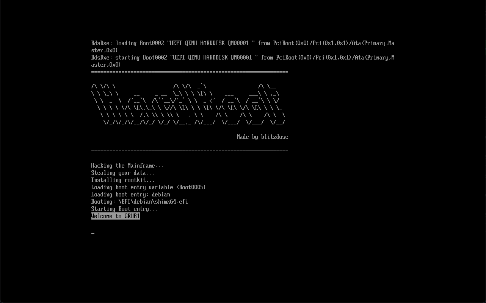

# HardBoot
A hardware boot order switch

This project uses a RP2040 zero and a switch to select which OS to boot.
It emulates an EFI partition and comes with it's own EFI application
that will boot the appropriate OS.



## Configuration

Configuration is pretty simple. 
1. Build the project or download the pre-build binaries
2. Flash them to your RP2040 Zero. Connect a switch between `GPIO15` and `GND`.
3. Reboot your system and head into the UEFI.
4. Change the boot order to always boot to the "HardBoot" partition first
5. Setup the other boot order options, so that the second boot option is the 
OS you want to boot when the switch is off and the third boot option is the OS
you want to boot when the switch is on.
6. Save, reboot and see the magic happen

## Building

To build the project do the following steps. Currently only Linux is supported. Use WSL if you are on Windows.

1. Clone this repo including it's submodules

```
git clone https://github.com/blitzdose/HardBoot.git
git submodule update --init --recursive
```

2. Install nececcary tools

```
sudo apt install mtools
```

3. Build

```
make
```

4. Upload

Either run `make upload` or the following commands manually to upload:

```
picotool load -n build/fat12.img -t bin -o 0x10010000
picotool load -f -x build/waveshare_rp2040_zero.uf2.uf2
```
